# 07. End-to-End Flow

Dokumen ini menjelaskan **alur end-to-end sistem secara teknikal**
mulai dari **device boot**, **MQTT connect**, **konfigurasi**, **task execution**,
hingga **alarm reporting via HTTP**.

Dokumen ini menggabungkan seluruh bagian sebelumnya (02–06)
ke dalam **flow operasional nyata**.

---
## 7.1 High-Level System Flow

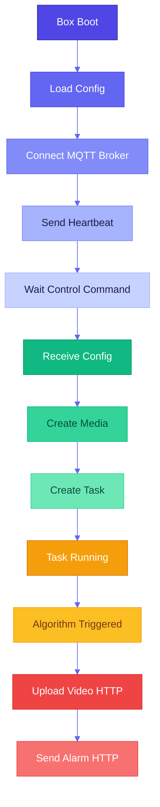
---

## 7.2 Device Boot & Initialization

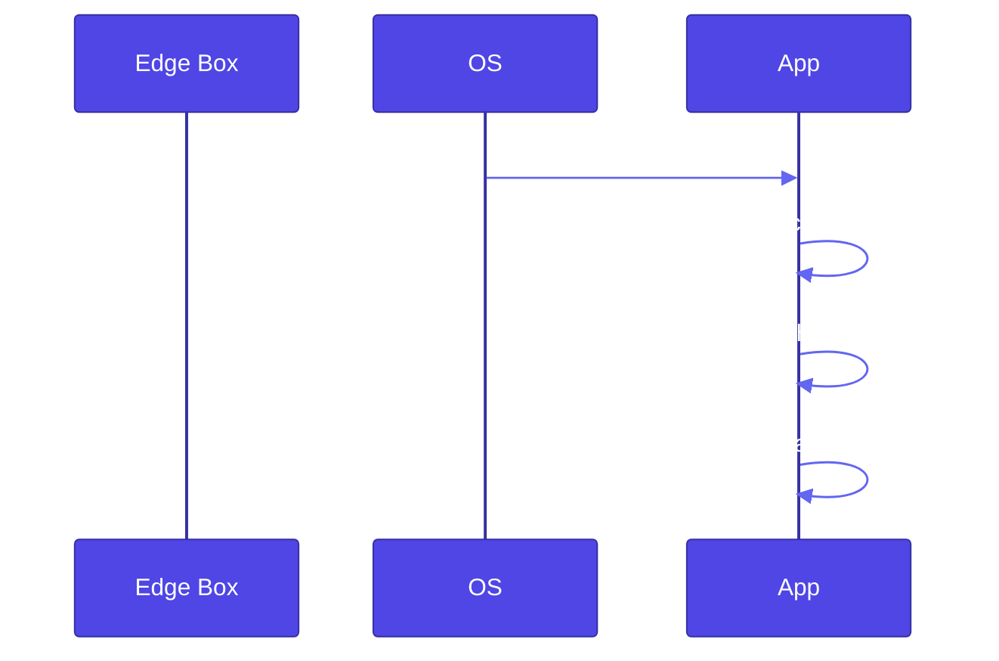
---

## 7.3 MQTT Connection & Heartbeat
### 7.3.1 MQTT Connect Flow

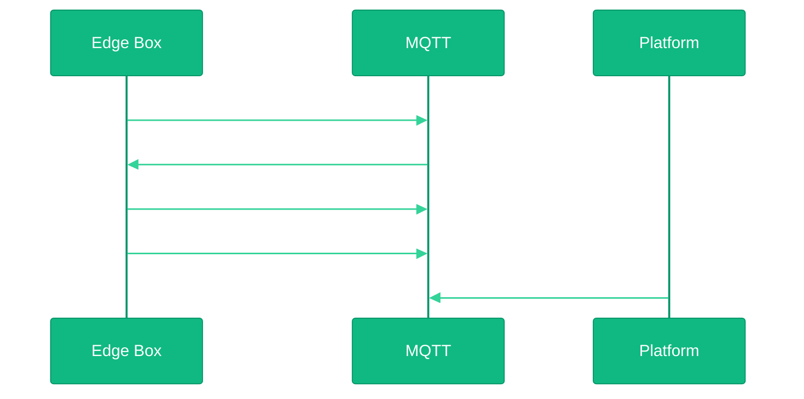
---

### 7.3.2 Heartbeat Runtime Flow
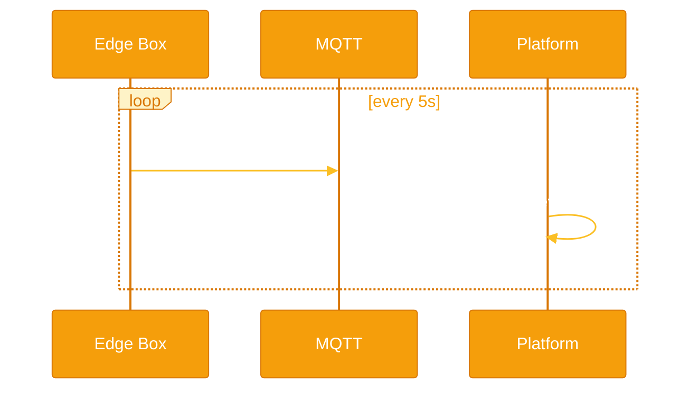
---

## 7.4 Capability Discovery Flow
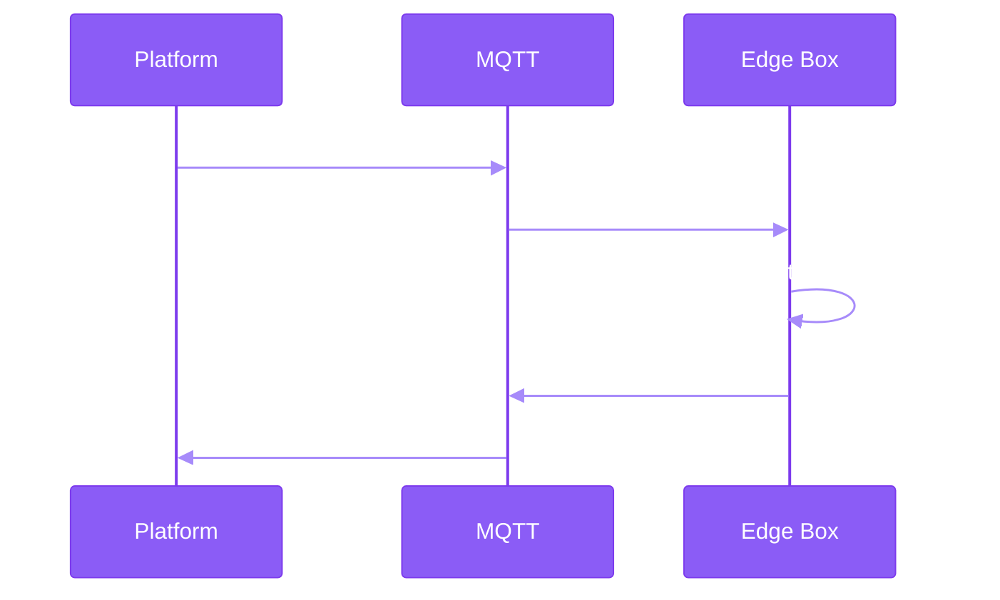
---

## 7.5 Media Channel Configuration Flow
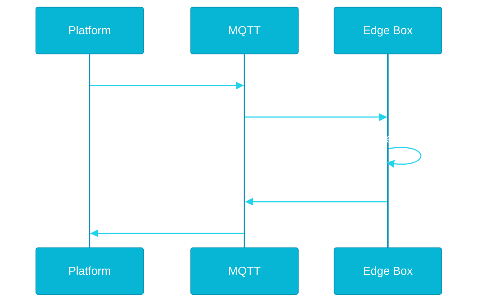

Failure path (RTSP error):
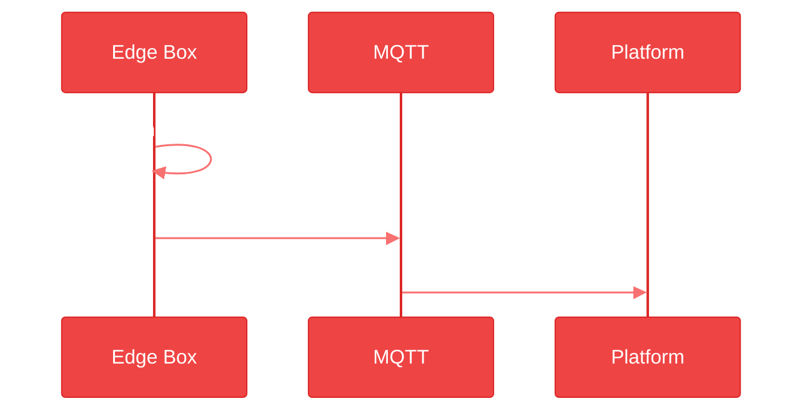
---

## 7.6 Algorithm Task Creation Flow
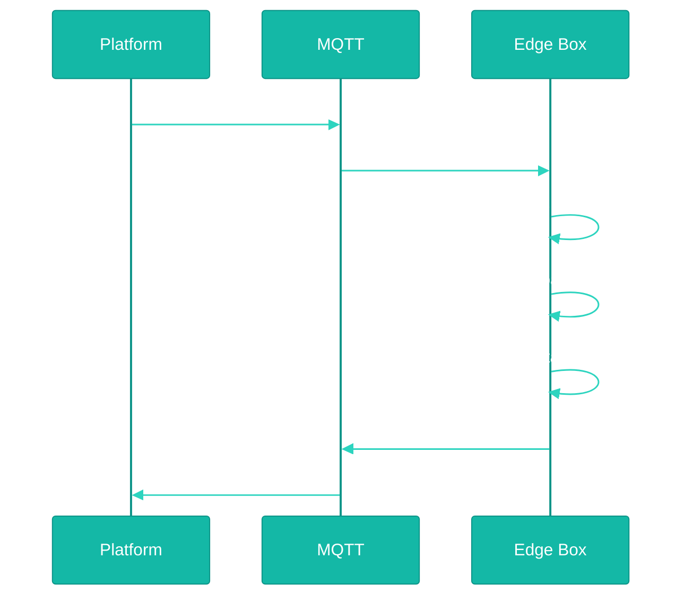
---

## 7.7 Task Runtime Execution

---

## 7.8 Alarm Reporting End-to-End Flow
### 7.8.1 Normal Alarm Flow (With Video)
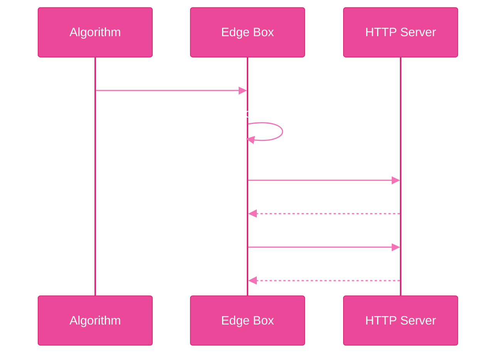
---

### 7.8.2 Alarm Flow (Without Video)
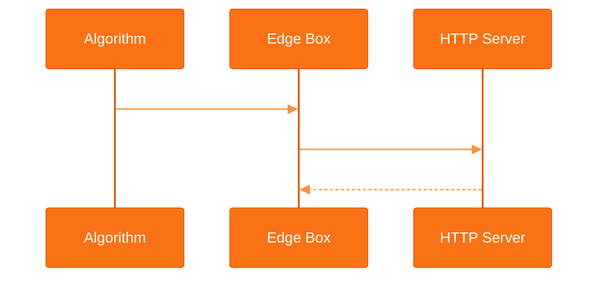
---

## 7.9 Alarm Failure & Retry Flow
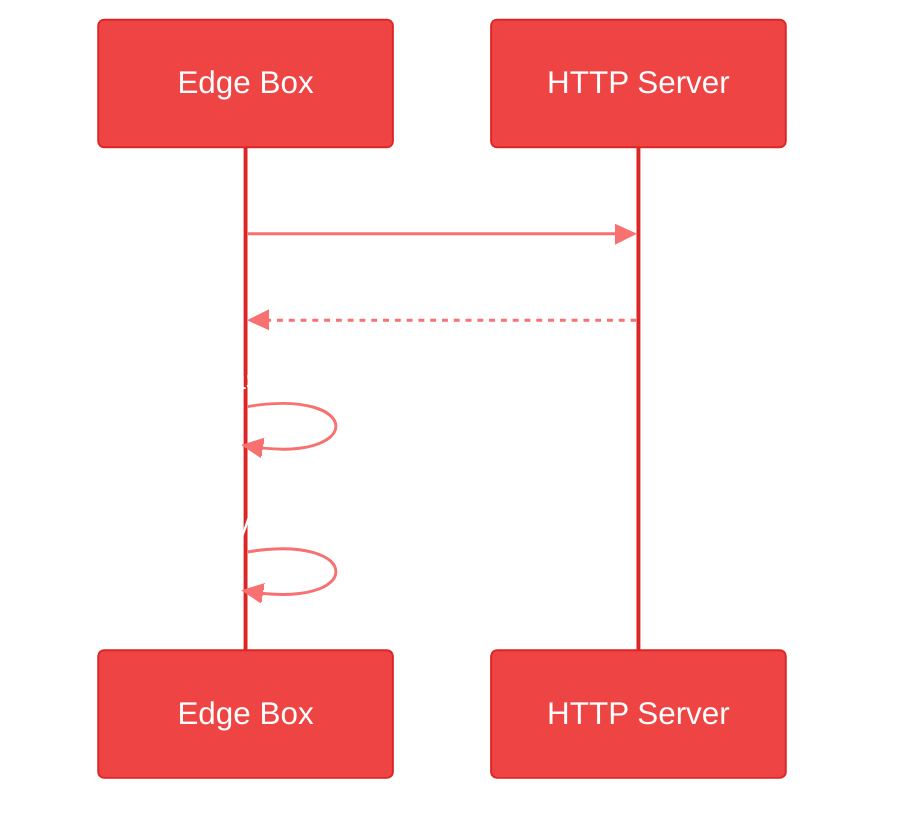

Retry policy:
- Retry internal queue
- Backoff strategy
- Max retry configurable

---

## 7.10 Task Control Flow (Start / Stop)
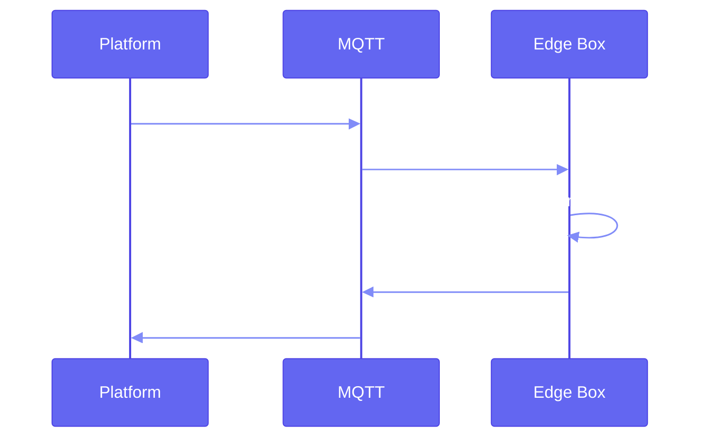
---

## 7.11 Task Delete Flow
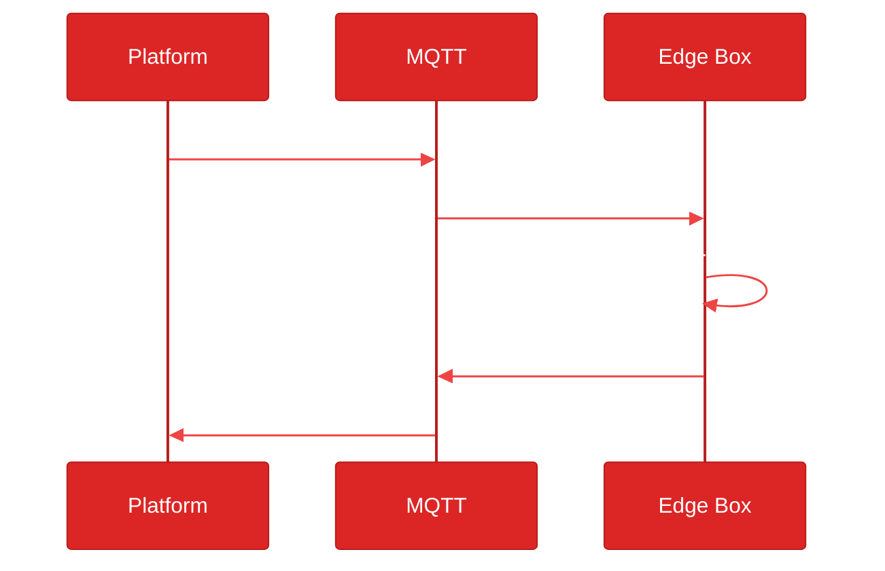
---

## 7.12 Schedule Impact Flow
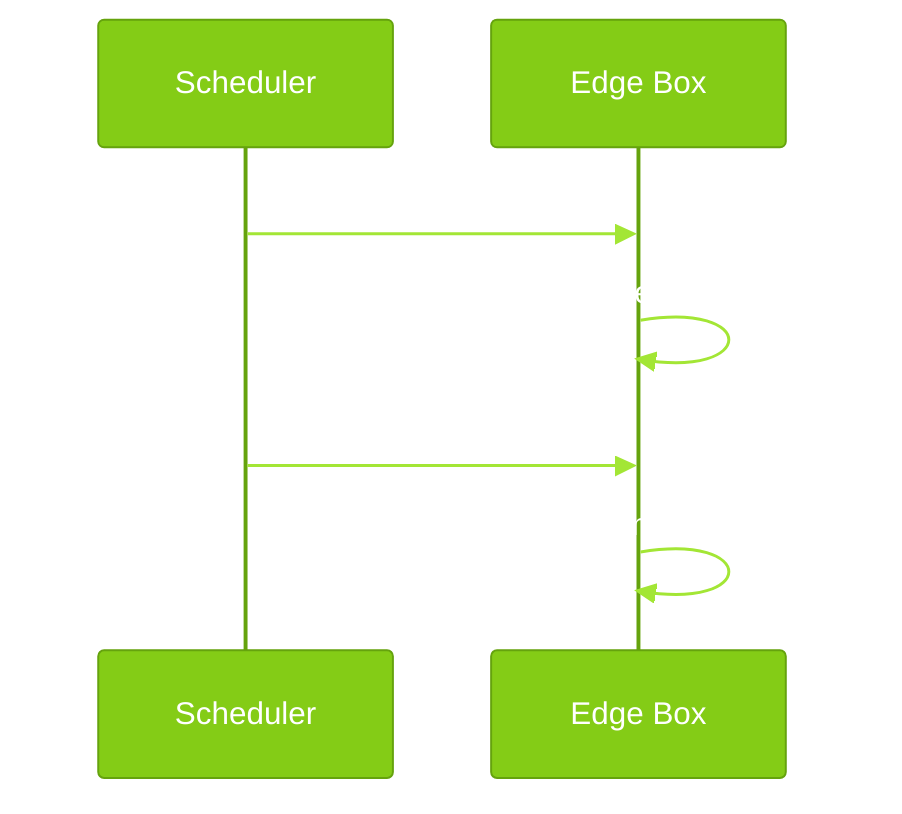
---

## 7.13 Failure Domains Overview
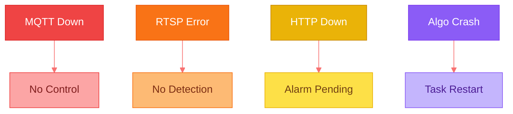
---

## 7.14 End-to-End Responsibility Matrix
|Component|Responsibility|
|-|-|
|Edge Box|Detection, execution, reporting|
|MQTT|Control plane|
|HTTP|Data plane|
|Platform|Orchestration|
|Algorithm|Intelligence|

---

## 7.15 End-to-End Summary

